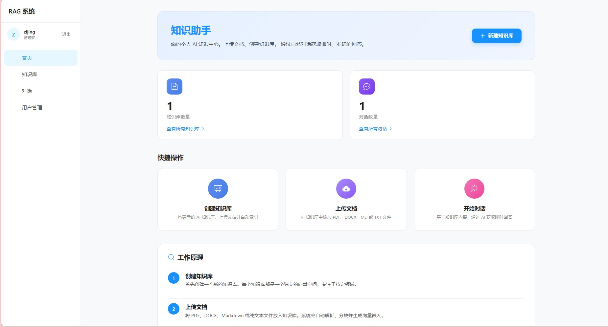
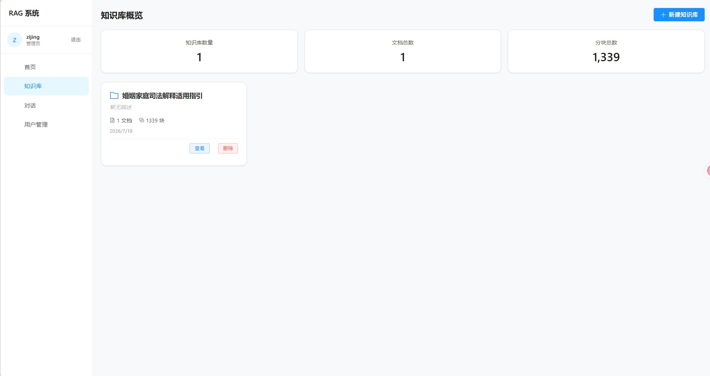
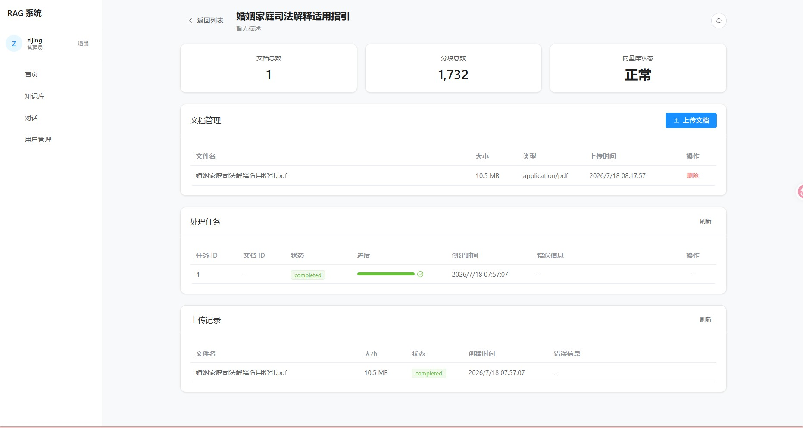
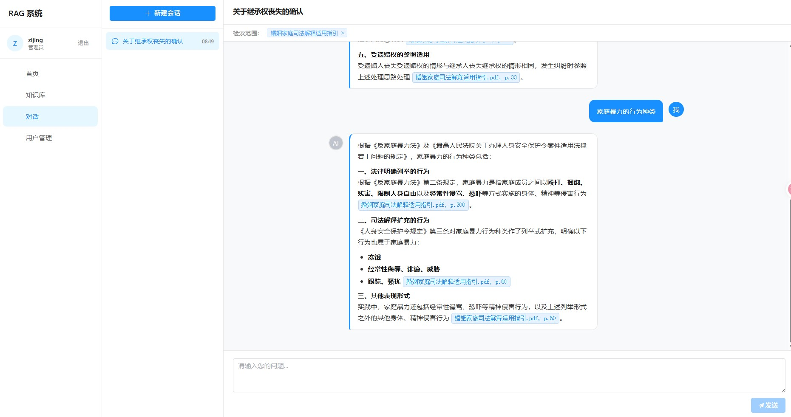

# RAG Service

基于 FastAPI + LangChain + Milvus 的企业级文档问答系统，支持多知识库隔离、Hybrid 检索、Cross-encoder 精排、流式输出与会话记忆。

## 核心特性

- **Small-to-Big 父子索引**：父块 1024 token/ 子块 256 token，解决"语义完整 vs 检索精度"矛盾
- **Hybrid 检索**：向量（bge-m3）+ BM25（jieba 分词）用 RRF 融合，兼顾语义召回与关键词精确匹配（订单号/SKU 等场景）
- **Cross-encoder 二阶段精排**：bge-reranker-v2-m3 弥补 bi-encoder 丢失的 query-doc 交互信息
- **多知识库隔离**：按 kb_id 过滤检索范围，支持对话绑定知识库
- **用户认证与权限**：JWT + bcrypt + is_active 双校验，superuser 管理后台
- **对象存储**：MinIO（可切换本地存储），文档查重避免孤儿对象
- **会话记忆**：Redis 热缓存 + MySQL 持久化双层存储
- **流式输出**：SSE 逐 token 推送，行内引用胶囊可点击查看来源

## 技术栈

| 层 | 组件 |
|---|---|
| 后端框架 | FastAPI + uvicorn + asyncio |
| LLM 编排 | LangChain + LangChain-Core |
| 向量数据库 | Milvus Standalone（HNSW + COSINE） |
| 关系数据库 | MySQL 8.x（SQLAlchemy + aiomysql） |
| 对象存储 | MinIO（aioboto3） |
| 缓存 | Redis（对话记忆热缓存） |
| Embedding | Ollama + bge-m3（1024D，BAAI 中文 SOTA） |
| Reranker | bge-reranker-v2-m3（Cross-encoder，CPU 推理） |
| LLM | step-3.7-flash（OpenAI 兼容接口） |
| 前端 | Vue 3 + Element Plus + Vite |

## 快速开始

### 前置依赖

1. **Ollama** + bge-m3 模型
   ```bash
   ollama pull bge-m3
   ```

2. **外部服务**（MySQL / Milvus / MinIO / Redis）
   ```bash
   docker compose up -d
   ```

3. **Reranker 模型**（首次需联网下载 ~2GB）
   ```bash
   # 首次下载：临时取消 .env 中的 HF_HUB_OFFLINE=1
   python -c "from transformers import AutoModelForSequenceClassification, AutoTokenizer; AutoTokenizer.from_pretrained('BAAI/bge-reranker-v2-m3'); AutoModelForSequenceClassification.from_pretrained('BAAI/bge-reranker-v2-m3')"
   # 下载完成后恢复 HF_HUB_OFFLINE=1
   ```

### 后端服务

```bash
# 激活虚拟环境
.venv\Scripts\activate

# 安装依赖
pip install -r backend/requirements.txt

# 配置环境变量
cp .env.example .env
# 编辑 .env 填写 OPENAI_API_KEY、DATABASE_URL、JWT_SECRET_KEY 等

# 启动服务（在项目根目录执行）
uvicorn backend.main:app --reload --host 0.0.0.0 --port 8000
```

### 前端界面

```bash
cd frontend
npm install
npm run dev
```

访问 `http://localhost:5173` 查看前端界面。

## 界面预览

### 



### 知识库管理



### 知识库页面



### 首页

### 对话问答



## 架构

### 文档入库流程

```
上传 → 查重(file_hash) → MinIO 存储 → loaders.py → splitter.py(父子两级切分)
    → embedder.py(bge-m3) → Milvus(子块向量) + MySQL(父块全文+子块元数据)
```

### 问答检索流程（V5 Hybrid + Rerank）

```
用户问题
    ├─→ 向量检索：bge-m3 embed → Milvus HNSW 查子块 top_k=20
    ├─→ BM25 检索：jieba 分词 → 子块关键词召回 top_k=20
    │
    ↓ RRF 融合（k=60，chunk_id 维度）
    │
    ↓ 按 parent_id 聚合取 top_k=4 父块候选
    │
    ↓ MySQL 批量回查父块全文
    │
    ↓ Cross-encoder 精排（bge-reranker-v2-m3）
    │
    ↓ assemble_context（带 [filename, p.X] 引用标记）
    │
    ↓ LLM 流式生成（SSE 推送 token）
    │
    ↓ extract_cited_sources 过滤实际引用的来源
    │
    ↓ 持久化对话记忆（Redis + MySQL）
```

## 配置

编辑 `.env` 文件：

### 核心配置
- `LLM_PROVIDER` / `LLM_MODEL`：LLM 提供者与模型
- `OPENAI_BASE_URL` / `OPENAI_API_KEY`：OpenAI 兼容接口配置
- `EMBEDDING_PROVIDER` / `EMBEDDING_MODEL`：Embedding 提供者与模型
- `DATABASE_URL`：MySQL 连接串
- `MILVUS_URI`：Milvus Standalone 地址
- `JWT_SECRET_KEY`：JWT 签名密钥（生产环境必须修改）

### 检索调参
- `TOP_K`：最终返回的文档数（默认 4）
- `HYBRID_SEARCH_ENABLED`：是否启用 Hybrid 检索
- `HYBRID_VECTOR_TOP_K` / `HYBRID_bm25_TOP_K`：融合前各分支召回数
- `HYBRID_RRF_K`：RRF 平滑参数（默认 60）
- `RERANK_ENABLED`：是否启用 Cross-encoder 精排
- `RERANK_MODEL` / `RERANK_MAX_LENGTH`：Reranker 模型配置

### 性能与离线
- `EMBEDDING_BATCH_SIZE`：Embedding 批量大小（避免 Ollama 子进程压力过大）
- `HF_HUB_OFFLINE` / `TRANSFORMERS_OFFLINE`：HuggingFace 离线模式（避免联网检查卡顿）

## 项目结构

```
rag/
├── backend/
│   ├── api/                 # FastAPI 路由
│   ├── auth/                # JWT 认证
│   ├── cache/               # Redis 客户端
│   ├── core/                # 全局配置
│   ├── db/                  # 数据库连接
│   ├── ingestion/           # 文档入库（loaders/splitter/embedder/pipeline）
│   ├── retrieval/           # 检索（retriever/bm25/reranker/generator）
│   ├── vectorstore/         # Milvus 向量存储
│   ├── service/             # 业务服务
│   └── main.py              # FastAPI 入口
├── frontend/                # Vue 3 前端
├── docs/                    # 架构文档
└── .env                     # 环境变量
```

